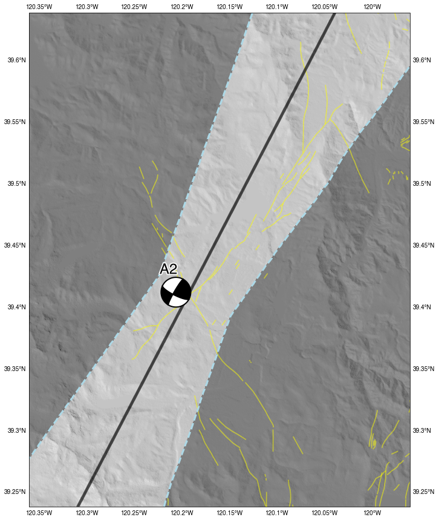
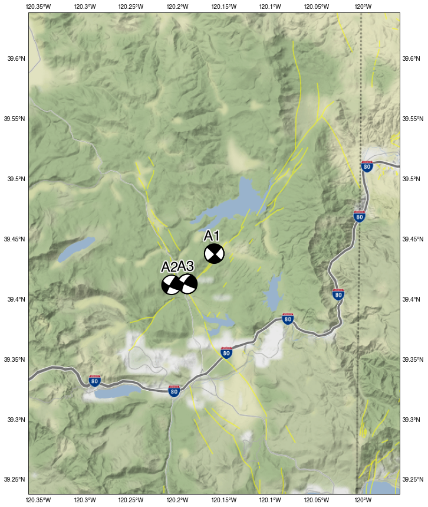
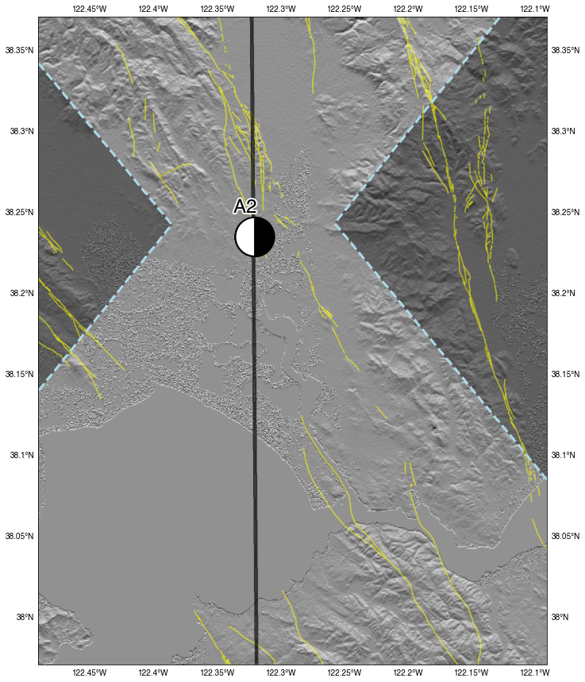
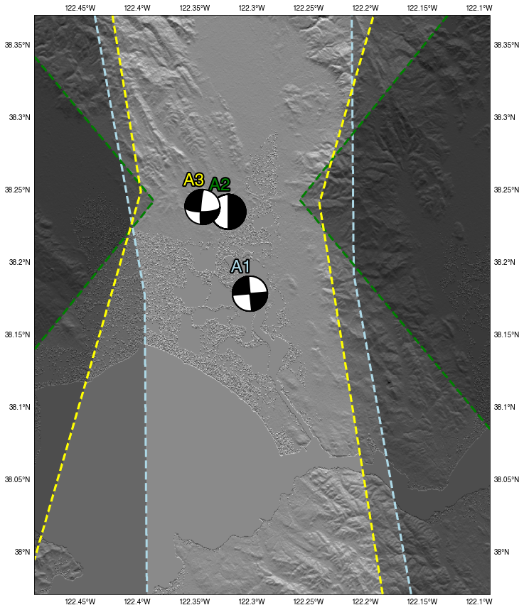

# SEISMO-LINEAMENT ANALYSIS METHOD (SLAM)

Main Project Resources: [PAJER, Luke](mailto:luke.pajer@gmail.com); [CRONIN, Vincent](mailto:vince_cronin@baylor.edu)

_Last Updated: October 2020_

[](http://croninprojects.org/)
[](/LICENSE)
[](https://jupyterlab.readthedocs.io/en/stable/)
[](https://jupyterlab.readthedocs.io/en/stable/)

-----

# PROJECT OVERVIEW

The Seismo-Lineament Analysis Method (SLAM) Python package is a simple translation of the mathematica code developed by Vince Cronin. The purpose of this package is to make SLAM available to those who are interested in SLAM, but are more comfortable using Python.

_From [Vince Cronin's website](https://croninprojects.org/Vince/SLAM/index.htm):_

> The seismo-lineament analysis method is a tool to spatially correlate a shallow-focus earthquake to the surface trace of the fault that generated it. SLAM is the intellectual property and work product of Vince Cronin, and has been developed with assistance from Brandon Rasaka, Victoria Worrell, Jeremy Ashburn, Brian Bayliss, Chris Breed, Bruce Byars, Ryan Campbell, David Cleveland, Jon Cook, Kelly Cronin, Jordan Dickinson, Daniel Lancaster, Ryan Lindsay, Mark Millard, Shane Prochnow, Tyler Reed, Stephen Secrest, Lauren Seidman Robinson, Keith Sverdrup and Lisa Zygo, with funds from AAPG, Baylor University, Colorado Scientific Society, Ellis Exploration, Ft. Worth Geological Society, Geological Society of America, GCAGS, Samson Resources, Roy Shlemon Scholarship Fund, Sigma Xi, and SIPES.

If there are any issues or concerns with the python package, please reach out to [Luke Pajer](mailto:luke.pajer@gmail.com). For any questions regarding SLAM, please reach out to [Vince Cronin](mailto:vince_cronin@baylor.edu).

-----

# CONTRIBUTORS

This project is an open project, and contributions are welcome from any individual. All contributors to this project are bound by a [code of conduct](/CODE_OF_CONDUCT.md). Please review and follow this code of conduct as part of your contribution.

#### Contributions to the SLAM Python Package
- [Luke Pajer](mailto:luke.pajer@gmail.com) [](https://orcid.org/0000-0002-5218-7650)

#### SLAM Author/Developer
- [Vince Cronin](mailto:vince_cronin@baylor.edu) [](https://orcid.org/0000-0002-3069-6470)

In addition, there are a few thesis projects used when developing the SLAM package. These were instrumental in developing and troubleshooting the package. Below are the Thesis projects referenced during development:

- Victoria E. Worrell: ["The Seismo-Lineament Analysis Method (SLAM) Applied to the South Napa Earthquake and Antecedent Events"](https://baylor-ir.tdl.org/bitstream/handle/2104/9796/WORRELL-THESIS-2016.pdf?sequence=1&isAllowed=y) 
- Jeremy A. Ashburn: ["Investigation of a Lineament that Might Mark the Ground-Surface Trace of the Dog Valley Fault, Truckee Area, Northern California"](https://croninprojects.org/Vince/AshburnBSThesis2015.pdf) 
- Brandon M. Rasaka: ["Correlation of Selected Earthquakes with Seismogenic Faults, Central Oklahoma"](https://croninprojects.org/Rasaka/Rasaka-MS-Thesis-2016.pdf)

-----

# HOW TO USE THIS REPOSITORY

## TABLE OF CONTENTS

### &nbsp; [1&nbsp;&nbsp;&nbsp; SLAM CALCULATOR OVERVIEW](#section1)

#### &nbsp;&nbsp;&nbsp;&nbsp;&nbsp;&nbsp;&nbsp;&nbsp;&nbsp; [1.1 &nbsp;&nbsp;&#8239; Query Open Topography for DEM File](#section1.1)

##### &nbsp;&nbsp;&nbsp;&nbsp;&nbsp;&nbsp;&nbsp;&nbsp;&nbsp;&nbsp;&nbsp;&nbsp;&nbsp;&nbsp;&nbsp;&nbsp;&nbsp;&nbsp;&nbsp;&nbsp;&nbsp; [1.1.0 &nbsp;&nbsp; Set DEM File Boundaries](#section1.1.0)
##### &nbsp;&nbsp;&nbsp;&nbsp;&nbsp;&nbsp;&nbsp;&nbsp;&nbsp;&nbsp;&nbsp;&nbsp;&nbsp;&nbsp;&nbsp;&nbsp;&nbsp;&nbsp;&nbsp;&nbsp;&nbsp; [1.1.1 &nbsp;&nbsp;&#8239; Get DEM File](#section1.1.1)

#### &nbsp;&nbsp;&nbsp;&nbsp;&nbsp;&nbsp;&nbsp;&nbsp;&nbsp; [1.2 &nbsp;&nbsp; Get Quaternary Faults and Folds Shapefile](#section1.2)

##### &nbsp;&nbsp;&nbsp;&nbsp;&nbsp;&nbsp;&nbsp;&nbsp;&nbsp;&nbsp;&nbsp;&nbsp;&nbsp;&nbsp;&nbsp;&nbsp;&nbsp;&nbsp;&nbsp;&nbsp;&nbsp; [1.2.0 &nbsp;&nbsp; Instantiate QFaults Class](#section1.2.0)
##### &nbsp;&nbsp;&nbsp;&nbsp;&nbsp;&nbsp;&nbsp;&nbsp;&nbsp;&nbsp;&nbsp;&nbsp;&nbsp;&nbsp;&nbsp;&nbsp;&nbsp;&nbsp;&nbsp;&nbsp;&nbsp; [1.2.1 &nbsp;&nbsp;&#8239; Different Shape Files Available via USGS](#section1.2.1)

#### &nbsp;&nbsp;&nbsp;&nbsp;&nbsp;&nbsp;&nbsp;&nbsp;&nbsp; [1.3 &nbsp;&nbsp; Obtain Event Data](#section1.3)

##### &nbsp;&nbsp;&nbsp;&nbsp;&nbsp;&nbsp;&nbsp;&nbsp;&nbsp;&nbsp;&nbsp;&nbsp;&nbsp;&nbsp;&nbsp;&nbsp;&nbsp;&nbsp;&nbsp;&nbsp;&nbsp; [1.3.0 &nbsp;&nbsp; Instantiate the 'get_data' Class](#section1.3.0)
##### &nbsp;&nbsp;&nbsp;&nbsp;&nbsp;&nbsp;&nbsp;&nbsp;&nbsp;&nbsp;&nbsp;&nbsp;&nbsp;&nbsp;&nbsp;&nbsp;&nbsp;&nbsp;&nbsp;&nbsp;&nbsp; [1.3.1 &nbsp;&nbsp;&#8239; Query for Events within the DEM Area](#section1.3.1)
##### &nbsp;&nbsp;&nbsp;&nbsp;&nbsp;&nbsp;&nbsp;&nbsp;&nbsp;&nbsp;&nbsp;&nbsp;&nbsp;&nbsp;&nbsp;&nbsp;&nbsp;&nbsp;&nbsp;&nbsp;&nbsp; [1.3.2 &nbsp;&nbsp; Get Individual Focal Data](#section1.3.2)
##### &nbsp;&nbsp;&nbsp;&nbsp;&nbsp;&nbsp;&nbsp;&nbsp;&nbsp;&nbsp;&nbsp;&nbsp;&nbsp;&nbsp;&nbsp;&nbsp;&nbsp;&nbsp;&nbsp;&nbsp;&nbsp; [1.3.3 &nbsp;&nbsp; Viewing Error Data](#section1.3.3)
##### &nbsp;&nbsp;&nbsp;&nbsp;&nbsp;&nbsp;&nbsp;&nbsp;&nbsp;&nbsp;&nbsp;&nbsp;&nbsp;&nbsp;&nbsp;&nbsp;&nbsp;&nbsp;&nbsp;&nbsp;&nbsp; [1.3.4 &nbsp;&nbsp; Focal and Error Data Combined](#section1.3.4)

#### &nbsp;&nbsp;&nbsp;&nbsp;&nbsp;&nbsp;&nbsp;&nbsp;&nbsp; [1.4 &nbsp;&nbsp; Prepare Variables for Swath Calculations](#section1.4)

##### &nbsp;&nbsp;&nbsp;&nbsp;&nbsp;&nbsp;&nbsp;&nbsp;&nbsp;&nbsp;&nbsp;&nbsp;&nbsp;&nbsp;&nbsp;&nbsp;&nbsp;&nbsp;&nbsp;&nbsp;&nbsp; [1.4.0 &nbsp;&nbsp; Instantiate the 'swaths' Class](#section1.4.0)
##### &nbsp;&nbsp;&nbsp;&nbsp;&nbsp;&nbsp;&nbsp;&nbsp;&nbsp;&nbsp;&nbsp;&nbsp;&nbsp;&nbsp;&nbsp;&nbsp;&nbsp;&nbsp;&nbsp;&nbsp;&nbsp; [1.4.1 &nbsp;&nbsp;&#8239; Calculate Grid North Adjustment](#section1.4.1)
##### &nbsp;&nbsp;&nbsp;&nbsp;&nbsp;&nbsp;&nbsp;&nbsp;&nbsp;&nbsp;&nbsp;&nbsp;&nbsp;&nbsp;&nbsp;&nbsp;&nbsp;&nbsp;&nbsp;&nbsp;&nbsp; [1.4.2 &nbsp;&nbsp; Combine Focal Data Points](#section1.4.2)
##### &nbsp;&nbsp;&nbsp;&nbsp;&nbsp;&nbsp;&nbsp;&nbsp;&nbsp;&nbsp;&nbsp;&nbsp;&nbsp;&nbsp;&nbsp;&nbsp;&nbsp;&nbsp;&nbsp;&nbsp;&nbsp; [1.4.3 &nbsp;&nbsp; Computations of the 1st Nodal Plane](#section1.4.3)
##### &nbsp;&nbsp;&nbsp;&nbsp;&nbsp;&nbsp;&nbsp;&nbsp;&nbsp;&nbsp;&nbsp;&nbsp;&nbsp;&nbsp;&nbsp;&nbsp;&nbsp;&nbsp;&nbsp;&nbsp;&nbsp; [1.4.4 &nbsp;&nbsp; Determine Errors Relative to the Nodal Plane](#section1.4.4)
##### &nbsp;&nbsp;&nbsp;&nbsp;&nbsp;&nbsp;&nbsp;&nbsp;&nbsp;&nbsp;&nbsp;&nbsp;&nbsp;&nbsp;&nbsp;&nbsp;&nbsp;&nbsp;&nbsp;&nbsp;&nbsp; [1.4.5 &nbsp;&nbsp; Calculate Light Direction for DEM](#section1.4.5)

#### &nbsp;&nbsp;&nbsp;&nbsp;&nbsp;&nbsp;&nbsp;&nbsp;&nbsp; [1.5 &nbsp;&nbsp; Calculate Swaths and Seismo-Lineament Bounds](#section1.5)

##### &nbsp;&nbsp;&nbsp;&nbsp;&nbsp;&nbsp;&nbsp;&nbsp;&nbsp;&nbsp;&nbsp;&nbsp;&nbsp;&nbsp;&nbsp;&nbsp;&nbsp;&nbsp;&nbsp;&nbsp;&nbsp; [1.5.0 &nbsp;&nbsp; Calculate Swaths](#section1.5.0)
##### &nbsp;&nbsp;&nbsp;&nbsp;&nbsp;&nbsp;&nbsp;&nbsp;&nbsp;&nbsp;&nbsp;&nbsp;&nbsp;&nbsp;&nbsp;&nbsp;&nbsp;&nbsp;&nbsp;&nbsp;&nbsp; [1.5.1 &nbsp;&nbsp;&#8239; Determine Seismo-Lineament Bounds](#section1.5.1)

#### &nbsp;&nbsp;&nbsp;&nbsp;&nbsp;&nbsp;&nbsp;&nbsp;&nbsp; [1.6 &nbsp;&nbsp; Visualize Seismo-Lineament Bounds](#section1.6)

##### &nbsp;&nbsp;&nbsp;&nbsp;&nbsp;&nbsp;&nbsp;&nbsp;&nbsp;&nbsp;&nbsp;&nbsp;&nbsp;&nbsp;&nbsp;&nbsp;&nbsp;&nbsp;&nbsp;&nbsp;&nbsp; [1.6.0 &nbsp;&nbsp; Instantiate the 'SLAM_Viz' Class](#section1.6.0)
##### &nbsp;&nbsp;&nbsp;&nbsp;&nbsp;&nbsp;&nbsp;&nbsp;&nbsp;&nbsp;&nbsp;&nbsp;&nbsp;&nbsp;&nbsp;&nbsp;&nbsp;&nbsp;&nbsp;&nbsp;&nbsp; [1.6.1 &nbsp;&nbsp;&#8239; Elevation Map using Open Topography DEM File](#section1.6.1)
##### &nbsp;&nbsp;&nbsp;&nbsp;&nbsp;&nbsp;&nbsp;&nbsp;&nbsp;&nbsp;&nbsp;&nbsp;&nbsp;&nbsp;&nbsp;&nbsp;&nbsp;&nbsp;&nbsp;&nbsp;&nbsp; [1.6.2 &nbsp;&nbsp; Physical Map using Stamen and OpenStreetMap](#section1.6.2)
##### &nbsp;&nbsp;&nbsp;&nbsp;&nbsp;&nbsp;&nbsp;&nbsp;&nbsp;&nbsp;&nbsp;&nbsp;&nbsp;&nbsp;&nbsp;&nbsp;&nbsp;&nbsp;&nbsp;&nbsp;&nbsp; [1.6.3 &nbsp;&nbsp; Multiple Solutions - Elevation Map](#section1.6.3)
##### &nbsp;&nbsp;&nbsp;&nbsp;&nbsp;&nbsp;&nbsp;&nbsp;&nbsp;&nbsp;&nbsp;&nbsp;&nbsp;&nbsp;&nbsp;&nbsp;&nbsp;&nbsp;&nbsp;&nbsp;&nbsp; [1.6.4 &nbsp;&nbsp; Multiple Solutions - Physical Map](#section1.6.4)

### &nbsp; [2&nbsp;&nbsp;&nbsp; TRUCKEE AREA, NORTHERN CALIFORNIA - ASHBURN THESIS](#section2)

#### &nbsp;&nbsp;&nbsp;&nbsp;&nbsp;&nbsp;&nbsp;&nbsp;&nbsp; [2.1 &nbsp;&nbsp;&#8239; 1966 Magnitude 6.0 Earthquake](#section2.1)

#### &nbsp;&nbsp;&nbsp;&nbsp;&nbsp;&nbsp;&nbsp;&nbsp;&nbsp; [2.2 &nbsp;&nbsp; 1983 Magnitude 4.0 Earthquake](#section2.2)

#### &nbsp;&nbsp;&nbsp;&nbsp;&nbsp;&nbsp;&nbsp;&nbsp;&nbsp; [2.3 &nbsp;&nbsp; 1992 Magnitude 3.2 Earthquake](#section2.3)

#### &nbsp;&nbsp;&nbsp;&nbsp;&nbsp;&nbsp;&nbsp;&nbsp;&nbsp; [2.4 &nbsp;&nbsp; Combined Solutions](#section2.4)


### &nbsp; [3&nbsp;&nbsp;&nbsp; SOUTH NAPA AREA, NORTHERN CALIFORNIA - WORRELL THESIS](#section3)  

#### &nbsp;&nbsp;&nbsp;&nbsp;&nbsp;&nbsp;&nbsp;&nbsp;&nbsp; [3.1 &nbsp;&nbsp;&#8239; 2014 Magnitude 3.9 Earthquake](#section3.1)

#### &nbsp;&nbsp;&nbsp;&nbsp;&nbsp;&nbsp;&nbsp;&nbsp;&nbsp; [3.2 &nbsp;&nbsp; 2014 Magnitude 3.8 Earthquake](#section3.2)

#### &nbsp;&nbsp;&nbsp;&nbsp;&nbsp;&nbsp;&nbsp;&nbsp;&nbsp; [3.3 &nbsp;&nbsp; 2014 Magnitude 3.6 Earthquake](#section3.3)

#### &nbsp;&nbsp;&nbsp;&nbsp;&nbsp;&nbsp;&nbsp;&nbsp;&nbsp; [3.4 &nbsp;&nbsp; Combined Solutions](#section3.4)


### &nbsp; [4&nbsp;&nbsp;&nbsp; SPARTA, NORTH CAROLINA - INITIAL INVESTIGATION](#section4)  

#### &nbsp;&nbsp;&nbsp;&nbsp;&nbsp;&nbsp;&nbsp;&nbsp;&nbsp; [4.1 &nbsp;&nbsp;&#8239; 2020 Magnitude 5.1 Earthquake](#section4.1)


### &nbsp; [5&nbsp;&nbsp;&nbsp; DOCUMENTATION](#section5)  

---

## <a name="section1">1&nbsp;&nbsp;&nbsp;&#8239; SLAM CALCULATOR OVERVIEW</a>

### <a name="section1.1">1.1&nbsp;&nbsp;&#8239; Query Open Topography for DEM File</a>

Import the SLAM calculator as 'slam'.

``` python
import geo_slam_calculator_v1 as slam
```

### <a name="section1.1.0">1.1.0&nbsp;&nbsp; Set DEM File Boundaries</a>

``` python
area = slam.DEM(longitude=-120.160, latitude=39.438, lon_del=0.2, lat_del=0.2)

lat_min, lat_max, lon_min, lon_max = area.get_bounds()

print(lat_min, lat_max, lon_min, lon_max)

```  

``` 
(39.238, 39.638000000000005, -119.96, -120.36)
```  


### <a name="section1.1.1">1.1.1&nbsp;&nbsp;&#8239; Get DEM File</a>

``` python
dem_file = area.get_dem(lat_min, lat_max, lon_min, lon_max)
```  

``` 
Begin Downloading DEM File...  
Downloaded DEM file in 7.6 seconds  
Processing...  
Complete.  
```  

### <a name="section1.2">1.2&nbsp;&nbsp; Get Quaternary Faults and Folds Shapefile</a>

``` python
from geo_slam_calculator_v1 import qFaults
```

### <a name="section1.2.0">1.2.0&nbsp;&nbsp; Instantiate QFaults Class</a>

``` python
qfaults = qFaults.get_qfaults()
```

### <a name="section1.2.1">1.2.1&nbsp;&nbsp;&#8239; Different Shape Files Available via USGS</a>

Default value for `get_qfaults` for the file name of the shape file is 'Qfaults_GIS'. Other files can be found on the [qfaults](https://earthquake.usgs.gov/static/lfs/nshm/qfaults/) page. However, not all of the files are shapefiles. If the selection is not a shape file, it will return an error.

### <a name="section1.3">1.3&nbsp;&nbsp; Obtain Event Data</a>

### <a name="section1.3.0">1.3.0&nbsp;&nbsp; Instantiate the 'get_data' Class</a>

``` python 
data = slam.get_data(lat_min=lat_min, lat_max=lat_max, lon_min=lon_min, lon_max=lon_max)
``` 

### <a name="section1.3.1">1.3.1&nbsp;&nbsp;&#8239; Query for Events within the DEM Area</a>

``` python
events_1983 = data.event_query(start_time='1983-07-02', end_time='1983-07-04', min_mag=3)
```

```
Downloaded Regional Earthquake Data in 0.6760 seconds
``` 


### <a name="section1.3.2">1.3.2&nbsp;&nbsp; Get Individual Focal Data</a>

``` python
focal_data_1983 = data.focal_data(earthquakes=events_1983)
focal_data_1983.focal_data
```


### <a name="section1.3.3">1.3.3&nbsp;&nbsp; Viewing Error Data</a>

``` python
focal_data_1983.error_data
``` 


### <a name="section1.3.4">1.3.4&nbsp;&nbsp; Focal and Error Data Combined</a>

``` python
eq1_1983 = focal_data_1983.data[focal_data_1983.data['ID']=='B2'].reset_index(drop=True)
``` 


### <a name="section1.4">1.4&nbsp;&nbsp; Prepare Variables for Swath Calculations</a>

### <a name="section1.4.0">1.4.0&nbsp;&nbsp; Instantiate the 'swaths' Class</a>

``` python
swaths_init = slam.swaths(elevation=dem_file.elevation)
```

### <a name="section1.4.1">1.4.1&nbsp;&nbsp;&#8239; Calculate Grid North Adjustment</a>

``` python
gridNorthAdjustment_1983 = swaths_init.grid_adjustment(longitude=-120.160, latitude=39.438, zoneMeridian=-123)
```

```
Grid North Adjustment: -1.80
```

### <a name="section1.4.2">1.4.2&nbsp;&nbsp; Combine Focal Data Points</a>

``` python
focal_data_1983 = swaths_init.focal_metrics(lon=-120.206, lat=39.412, depth=11.05)
```

```
Latitude: 39.412
Longitude: -120.206
Depth: -11050.0 meters
```

### <a name="section1.4.3">1.4.3&nbsp;&nbsp; Computations of the 1st Nodal Plane</a>

``` python
nodal_comps_1983 = swaths_init.nodal_comps(strike=eq1_1983.np1_strike, grid_adjust=gridNorthAdjustment_1983, 
                                           strike_uncert=eq1_1983.np1S_uncert, plunge=eq1_1983.np1_dip,
                                           dip_ang=eq1_1983.np1D_uncert)  

```  

```
Dip Trend: 300.0 
Dip Trend + North Grid Adjustment: 298.2 
Dip Trend Uncertainty: 8.0 
Dip Plunge: 80.0
Dip Angle Uncertainty: 13.0
```

### <a name="section1.4.4">1.4.4&nbsp;&nbsp; Determine Errors Relative to the Nodal Plane</a>

``` python
err_comps_1983 = swaths_init.err_computations(eh1=300, eh2=300, eh1Az=45, ez=0.8, grid_adjust=gridNorthAdjustment_1983)

``` 

```
eh1: 300.0 meters
eh1 Azimuth: 43.2 
eh2: 300.0 meters
ez: 800.0 meters
```

### <a name="section1.4.5">1.4.5&nbsp;&nbsp; Calculate Light Direction for DEM</a>

``` python
lightDirection_1983 = swaths_init.light_direction(nodal_comps_1983[1])
```

```
Light Direction: 61.80 
```

### <a name="section1.5">1.5&nbsp;&nbsp; Calculate Swaths and Seismo-Lineament Bounds</a>

### <a name="section1.5.0">1.5.0&nbsp;&nbsp; Calculate Swaths</a>

``` python
swaths_1983 = swaths_init.swath_calc(npDipPlunge=nodal_comps_1983[3], npDipAngUncert=nodal_comps_1983[4], 
                                     npDipTr=nodal_comps_1983[1], npDipTrendUncert=nodal_comps_1983[2], 
                                     widthFactor=1.5, multiplier=1.5, cellsize=dem_file.cellsize, 
                                     cellsize_res=30, eh1=err_comps_1983[0], eh1Az=err_comps_1983[1], 
                                     eh2=err_comps_1983[2], ez=err_comps_1983[3], lat=focal_data_1983[0], 
                                     lon=focal_data_1983[1], focalDepth=focal_data_1983[2], 
                                     bounds=dem_file.bounds, thin=False)
```                                     


### <a name="section1.5.1">1.5.1&nbsp;&nbsp;&#8239; Determine Seismo-Lineament Bounds</a>

``` python
swaths_shade_1983 = swaths_init.get_shade(swaths_1983.swaths, corners_fill=['NE', 'SW'])
```

```
Begin computing Seismo-Lineament boundary area
Finished assessment of Seismo-Lineament boundary area in 10.39 seconds
```

### <a name="section1.6">1.6&nbsp;&nbsp; Visualize Seismo-Lineament Bounds</a>

### <a name="section1.6.0">1.6.0&nbsp;&nbsp; Instantiate the 'SLAM_Viz' Class</a>

``` python
maps = slam.SLAM_viz(elevation=dem_file.elevation)
```

### <a name="section1.6.1">1.6.1&nbsp;&nbsp;&#8239; Elevation Map using Open Topography DEM File</a>

``` python
maps.elevation_map(middle_road=swaths_1983.middle_road, swaths_shade=swaths_shade_1983, 
                   lightDirection=lightDirection_1983, altDeg=12.5, lon=-120.206, lat=39.412, 
                   lon_max=lon_max, lon_min=lon_min, lat_max=lat_max, lat_min=lat_min, 
                   strike=eq1_1983.np1_strike, dip=eq1_1983.np1_dip, rake=eq1_1983.np1_rake, 
                   faults=qfaults, title='A2')
```  


<p align="center"></p>

### <a name="section1.6.2">1.6.2&nbsp;&nbsp; Physical Map using Stamen and OpenStreetMap</a>

``` python
maps.physical_map(middle_road=swaths_1983.middle_road, swaths_shade=swaths_shade_1983, 
                  lon=focal_data_1983[1], lat=focal_data_1983[0], lon_max=lon_max, 
                  lon_min=lon_min, lat_max=lat_max, lat_min=lat_min, strike=eq1_1983.np1_strike, 
                  dip=eq1_1983.np1_dip, rake=eq1_1983.np1_rake, title='A2', tiler_size=11, faults=qfaults)
```  


<p align="center"></p>

<p align="center">Map tiles by <a href='http://stamen.com'>Stamen Design</a>, under <a href='http://creativecommons.org/licenses/by/3.0'>CC BY 3.0</a>. Data by <a href='http://openstreetmap.org'>OpenStreetMap</a>, under <a href='http://www.openstreetmap.org/copyright'>ODbL</a></p>

### <a name="section1.6.3">1.6.3&nbsp;&nbsp; Multiple Solutions - Elevation Map</a>

_**These are the multiple solutions taken from section 2, the Ashburn thesis, section of this document.**_

Must put items into a list:

``` python
swaths_mult = [swaths.swaths, swaths_1983.swaths, swaths_1992.swaths]
middle_road_mult = [swaths.middle_road, swaths_1983.middle_road, swaths_1992.middle_road]
swaths_shade_mult = [swaths_shade, swaths_shade_1983, swaths_shade_1992]
lon_mult = [focal_data[1], focal_data_1983[1], focal_data_1992[1]]
lat_mult = [focal_data[0], focal_data_1983[0], focal_data_1992[0]]
strike_mult = [44, eq1_1983.np1_strike, eq1_1992.np1_strike]
dip_mult = [80, eq1_1983.np1_dip, eq1_1992.np1_dip]
rake_mult = [180, eq1_1983.np1_rake, eq1_1992.np1_rake]
title = ['A1', 'A2', 'A3']
colors_ = ['lightblue', 'green', 'yellow']
```

``` python
maps.elevation_mult(swaths_shade=swaths_shade_mult, lightDirection=lightDirection_1992, altDeg=12.5, 
                    lon=lon_mult, lat=lat_mult, lon_max=lon_max, lon_min=lon_min, 
                    lat_max=lat_max, lat_min=lat_min, strike=strike_mult, dip=dip_mult, 
                    rake=rake_mult, title=title, colors_=colors_, faults=qfaults)
```

<p align="center"></p>

### <a name="section1.6.4">1.6.4&nbsp;&nbsp; Multiple Solutions - Physical Map</a>

``` python
maps.physical_mult(lon=lon_mult, lat=lat_mult, lon_max=lon_max, lon_min=lon_min, 
                   lat_max=lat_max, lat_min=lat_min, strike=strike_mult, 
                   dip=dip_mult, rake=rake_mult, title=title, tiler_size=11, 
                   faults=qfaults, focal_size=0.5)
```

<p align="center"></p>

<p align="center">Map tiles by <a href='http://stamen.com'>Stamen Design</a>, under <a href='http://creativecommons.org/licenses/by/3.0'>CC BY 3.0</a>. Data by <a href='http://openstreetmap.org'>OpenStreetMap</a>, under <a href='http://www.openstreetmap.org/copyright'>ODbL</a></p>

---

## <a name="section2">2&nbsp;&nbsp;&nbsp;&#8239; TRUCKEE AREA, NORTHERN CALIFORNIA - ASHBURN THESIS</a>

#### Import the Slam Calculator Package

``` python
import geo_slam_calculator_v1 as slam
```

#### Define the DEM area

``` python
area = slam.DEM(longitude=-120.160, latitude=39.438, lon_del=0.2, lat_del=0.2)

lat_min, lat_max, lon_min, lon_max = area.get_bounds()
lat_min, lat_max, lon_min, lon_max

dem_file = area.get_dem(lat_min, lat_max, lon_min, lon_max)
```

``` 
Begin Downloading DEM File...  
Downloaded DEM file in 7.6 seconds  
Processing...  
Complete.  
```  

#### Get Quaternary Faults and Folds Shapefile

``` python
from geo_slam_calculator_v1 import qFaults

qfaults = qFaults.get_qfaults(qfaults_file='hazfaults2014')
```

```
Warning: Be courteous to the USGS API and do not download this file more than once, as this is a very large file.
Downloaded Quaternary Faults and Folds Shape File in 1.9 seconds
```

### <a name="section2.1">2.1&nbsp;&nbsp;&#8239; 1966 Magnitude 6.0 Earthquake</a>

#### Get the Earthquake Data for the 1966 Earthquake (not available from USGS)

Since the strike, dip, and rake for the nodal planes are not yet available via the API, these must be manually entered into the `nodal_comps` function below.

Additionally, since the error calculations are not available via the API, the error calculations should be entered in the `err_computations` function below.

``` python
swaths_init = slam.swaths(elevation=dem_file.elevation)

# Calculate the Grid North Adjustment
gridNorthAdjustment = swaths_init.grid_adjustment(longitude=-120.160, latitude=39.438, zoneMeridian=-123)

# Combine Focal Data Points
focal_data = swaths_init.focal_metrics(lon=-120.160, lat=39.438, depth=10)

# Nodal 1 Computations
nodal_comps = swaths_init.nodal_comps(strike=44, grid_adjust=gridNorthAdjustment, 
                                      strike_uncert=0, plunge=80,
                                      dip_ang=0)

# Determine Errors Relative to the Nodal Plane
err_comps = swaths_init.err_computations(eh1=2000, eh2=2000, eh1Az=45, ez=2, 
                                         grid_adjust=gridNorthAdjustment)

# Calculate the Light Direction for the DEM map
lightDirection = swaths_init.light_direction(nodal_comps[1])

```


#### Calcualte Swath Bounds

``` python
swaths = swaths_init.swath_calc(npDipPlunge=nodal_comps[3], npDipAngUncert=nodal_comps[4], 
                                npDipTr=nodal_comps[1], npDipTrendUncert=nodal_comps[2], 
                                widthFactor=1, multiplier=1.5, cellsize=dem_file.cellsize, 
                                cellsize_res=30, eh1=err_comps[0], eh1Az=err_comps[1], 
                                eh2=err_comps[2], ez=err_comps[3], lat=focal_data[0], 
                                lon=focal_data[1], focalDepth=focal_data[2], 
                                bounds=dem_file.bounds, thin=True)
```


#### Calculate Swath Shading

``` python
swaths_shade = swaths_init.get_shade(swaths.swaths, trend='EW')
```

```
Begin computing Seismo-Lineament boundary area
Finished assessment of Seismo-Lineament boundary area in 9.81 seconds
```

#### Plot Swaths for the 1966 Earthquake

``` python
maps = slam.SLAM_viz(elevation=dem_file.elevation)
```

``` python
maps.elevation_map(middle_road=swaths.middle_road, swaths_shade=swaths_shade, lightDirection=lightDirection, altDeg=12.5, 
                   lon=focal_data[1], lat=focal_data[0], lon_max=lon_max, lon_min=lon_min, 
                   lat_max=lat_max, lat_min=lat_min, strike=44, dip=80, 
                   rake=180, title='A1', faults=qfaults, facecolor='w', bgcolor='k')
```

<p align="center"></p>

``` python
maps.physical_map(middle_road=swaths.middle_road, swaths_shade=swaths_shade, lon=focal_data[1], lat=focal_data[0], lon_max=lon_max, 
                  lon_min=lon_min, lat_max=lat_max, lat_min=lat_min, strike=44, 
                  dip=80, rake=180, title='A1', faults=qfaults, 
                  facecolor='w', bgcolor='k', tiler_size=11)
```

<p align="center"></p>

<p align="center">Map tiles by <a href='http://stamen.com'>Stamen Design</a>, under <a href='http://creativecommons.org/licenses/by/3.0'>CC BY 3.0</a>. Data by <a href='http://openstreetmap.org'>OpenStreetMap</a>, under <a href='http://www.openstreetmap.org/copyright'>ODbL</a></p>

### <a name="section2.2">2.2&nbsp;&nbsp; 1983 Magnitude 4.0 Earthquake</a>

#### Get the Earthquake Data for the 1983 Earthquake

``` python
data = slam.get_data(lat_min=lat_min, lat_max=lat_max, lon_min=lon_min, lon_max=lon_max)
```

``` python
events_1983 = data.event_query(start_time='1983-07-02', end_time='1983-07-04', min_mag=3)
```

```
Downloaded Regional Earthquake Data in 0.6760 seconds
```


``` python
focal_data_1983 = data.focal_data(earthquakes=events_1983)
focal_data_1983.focal_data
```


``` python
focal_data_1983.error_data
```


---

#### Filter the data for the earthquake of interest

``` python
eq1_1983 = focal_data_1983.data[focal_data_1983.data['ID']=='B2'].reset_index(drop=True)
``` 


#### Prepare Variables for Swath Calculation

The `err_computations` function below is using the arguements provided in the Ashburn thesis project.

``` python
swaths_init = slam.swaths(elevation=dem_file.elevation)

# Calculate the Grid North Adjustment
gridNorthAdjustment_1983 = swaths_init.grid_adjustment(longitude=-120.160, latitude=39.438, zoneMeridian=-123)

# Combine Focal Data Points
focal_data_1983 = swaths_init.focal_metrics(lon=-120.206, lat=39.412, depth=11.05)

# Nodal 1 Computations
nodal_comps_1983 = swaths_init.nodal_comps(strike=eq1_1983.np1_strike, grid_adjust=gridNorthAdjustment_1983, 
                                      strike_uncert=eq1_1983.np1S_uncert, plunge=eq1_1983.np1_dip,
                                      dip_ang=eq1_1983.np1D_uncert)

# Determine Errors Relative to the Nodal Plane
err_comps_1983 = swaths_init.err_computations(eh1=300, eh2=300, eh1Az=45, ez=0.8, 
                                         grid_adjust=gridNorthAdjustment_1983)

# Calculate the Light Direction for the DEM map
lightDirection_1983 = swaths_init.light_direction(nodal_comps_1983[1])

```


#### Calcualte Swath Bounds

``` python
swaths_1983 = swaths_init.swath_calc(npDipPlunge=nodal_comps_1983[3], npDipAngUncert=nodal_comps_1983[4], 
                                     npDipTr=nodal_comps_1983[1], npDipTrendUncert=nodal_comps_1983[2], 
                                     widthFactor=1.5, multiplier=1.5, cellsize=dem_file.cellsize, 
                                     cellsize_res=30, eh1=err_comps_1983[0], eh1Az=err_comps_1983[1], 
                                     eh2=err_comps_1983[2], ez=err_comps_1983[3], lat=focal_data_1983[0], 
                                     lon=focal_data_1983[1], focalDepth=focal_data_1983[2], 
                                     bounds=dem_file.bounds, thin=False)
``` 


#### Calculate Swath Shading

``` python
swaths_shade_1983 = swaths_init.get_shade(swaths_1983.swaths, corners_fill=['NE', 'SW'])
```

```
Begin computing Seismo-Lineament boundary area
Finished assessment of Seismo-Lineament boundary area in 10.39 seconds
```

#### Plot Swaths for 1983 Earthquake

``` python
maps = slam.SLAM_viz(elevation=dem_file.elevation)
```

``` python
maps.elevation_map(middle_road=swaths_1983.middle_road, swaths_shade=swaths_shade_1983, 
                   lightDirection=lightDirection_1983, altDeg=12.5, lon=-120.206, lat=39.412, 
                   lon_max=lon_max, lon_min=lon_min, lat_max=lat_max, lat_min=lat_min, 
                   strike=eq1_1983.np1_strike, dip=eq1_1983.np1_dip, rake=eq1_1983.np1_rake, 
                   faults=qfaults, title='A2')
```

<p align="center"></p>

``` python
maps.physical_map(middle_road=swaths_1983.middle_road, swaths_shade=swaths_shade_1983, 
                  lon=focal_data_1983[1], lat=focal_data_1983[0], lon_max=lon_max, 
                  lon_min=lon_min, lat_max=lat_max, lat_min=lat_min, strike=eq1_1983.np1_strike, 
                  dip=eq1_1983.np1_dip, rake=eq1_1983.np1_rake, title='A2', tiler_size=11, faults=qfaults)
```

<p align="center"></p>

<p align="center">Map tiles by <a href='http://stamen.com'>Stamen Design</a>, under <a href='http://creativecommons.org/licenses/by/3.0'>CC BY 3.0</a>. Data by <a href='http://openstreetmap.org'>OpenStreetMap</a>, under <a href='http://www.openstreetmap.org/copyright'>ODbL</a></p>


### <a name="section2.3">2.3&nbsp;&nbsp; 1992 Magnitude 3.2 Earthquake</a>

#### Get the Earthquake Data for the 1992 Earthquake

``` python
events_1992 = data.event_query(start_time='1992-08-29', end_time='1992-08-31', min_mag=3)
```

```
Downloaded Regional Earthquake Data in 1.1810 seconds
```


``` python
focal_data_1992 = data.focal_data(earthquakes=events_1992)
focal_data_1992.focal_data
```


``` python
focal_data_1992.error_data
```


``` python
eq1_1992 = focal_data_1992.data[focal_data_1992.data['ID']=='A2'].reset_index(drop=True)
```


#### Prepare Variables for Swath Calculation

The `err_computations` function below is using the arguements provided in the Ashburn thesis project.

``` python
# Calculate the Grid North Adjustment
gridNorthAdjustment_1992 = swaths_init.grid_adjustment(longitude=-120.160, latitude=39.438, zoneMeridian=-123)

# Combine Focal Data Points
focal_data_1992 = swaths_init.focal_metrics(lon=eq1_1992.longitude[0], lat=eq1_1992.latitude[0], depth=5.344)

# Nodal 1 Computations
nodal_comps_1992 = swaths_init.nodal_comps(strike=eq1_1992.np2_strike, grid_adjust=gridNorthAdjustment_1992, 
                                      strike_uncert=eq1_1992.np2S_uncert, plunge=eq1_1992.np2_dip,
                                      dip_ang=eq1_1992.np2D_uncert)

# Determine Errors Relative to the Nodal Plane
err_comps_1992 = swaths_init.err_computations(eh1=539, eh2=26, eh1Az=64, ez=0.154, 
                                         grid_adjust=gridNorthAdjustment_1992)

# Calculate the Light Direction for the DEM map
lightDirection_1992 = swaths_init.light_direction(nodal_comps_1992[1])
```


#### Calcualte Swath Bounds

``` python
swaths_1992 = swaths_init.swath_calc(npDipPlunge=nodal_comps_1992[3], npDipAngUncert=nodal_comps_1992[4], 
                                     npDipTr=nodal_comps_1992[1], npDipTrendUncert=nodal_comps_1992[2], 
                                     widthFactor=1.5, multiplier=1.5, cellsize=dem_file.cellsize, 
                                     cellsize_res=30, eh1=err_comps_1992[0], eh1Az=err_comps_1992[1], 
                                     eh2=err_comps_1992[2], ez=err_comps_1992[3], lat=focal_data_1992[0], 
                                     lon=focal_data_1992[1], focalDepth=focal_data_1992[2], 
                                     bounds=dem_file.bounds, thin=False)
```


#### Calculate Swath Shading

``` python
swaths_shade_1992 = swaths_init.get_shade(swaths_1992.swaths, corners_fill=['NE', 'SW'])
```

```
Begin computing Seismo-Lineament boundary area
Finished assessment of Seismo-Lineament boundary area in 10.36 seconds
```

#### Plot Swaths for 1992 Earthquake

``` python
maps.elevation_map(middle_road=swaths_1992.middle_road, swaths_shade=swaths_shade_1992, lightDirection=lightDirection_1992, altDeg=12.5, 
                   lon=focal_data_1992[1], lat=focal_data_1992[0], lon_max=lon_max, lon_min=lon_min, 
                   lat_max=lat_max, lat_min=lat_min, strike=eq1_1992.np2_strike, dip=eq1_1992.np2_dip, 
                   rake=eq1_1992.np2_rake, title='A3', faults=qfaults)
```

<p align="center"></p>

``` python
maps.physical_map(middle_road=swaths_1992.middle_road, swaths_shade=swaths_shade_1992, lon=focal_data_1992[1], lat=focal_data_1992[0], 
                  lon_max=lon_max, lon_min=lon_min, lat_max=lat_max, lat_min=lat_min, strike=eq1_1992.np2_strike, 
                  dip=eq1_1992.np2_dip, rake=eq1_1992.np2_rake, title='A3', tiler_size=11, faults=qfaults)
```

<p align="center"></p>

<p align="center">Map tiles by <a href='http://stamen.com'>Stamen Design</a>, under <a href='http://creativecommons.org/licenses/by/3.0'>CC BY 3.0</a>. Data by <a href='http://openstreetmap.org'>OpenStreetMap</a>, under <a href='http://www.openstreetmap.org/copyright'>ODbL</a></p>

### <a name="section2.4">2.4&nbsp;&nbsp; Combined Solutions</a>

``` python
swaths_mult = [swaths.swaths, swaths_1983.swaths, swaths_1992.swaths]
middle_road_mult = [swaths.middle_road, swaths_1983.middle_road, swaths_1992.middle_road]
swaths_shade_mult = [swaths_shade, swaths_shade_1983, swaths_shade_1992]
lon_mult = [focal_data[1], focal_data_1983[1], focal_data_1992[1]]
lat_mult = [focal_data[0], focal_data_1983[0], focal_data_1992[0]]
strike_mult = [44, eq1_1983.np1_strike, eq1_1992.np1_strike]
dip_mult = [80, eq1_1983.np1_dip, eq1_1992.np1_dip]
rake_mult = [180, eq1_1983.np1_rake, eq1_1992.np1_rake]
title = ['A1', 'A2', 'A3']
colors_ = ['lightblue', 'green', 'yellow']
```

``` python
maps.elevation_mult(swaths_shade=swaths_shade_mult, lightDirection=lightDirection_1992, altDeg=12.5, 
                    lon=lon_mult, lat=lat_mult, lon_max=lon_max, lon_min=lon_min, 
                    lat_max=lat_max, lat_min=lat_min, strike=strike_mult, dip=dip_mult, 
                    rake=rake_mult, title=title, colors_=colors_, faults=qfaults)
```

<p align="center"></p>

``` python
maps.physical_mult(lon=lon_mult, lat=lat_mult, lon_max=lon_max, lon_min=lon_min, 
                   lat_max=lat_max, lat_min=lat_min, strike=strike_mult, 
                   dip=dip_mult, rake=rake_mult, title=title, tiler_size=11, 
                   faults=qfaults, focal_size=0.5)
```

<p align="center"></p>

<p align="center">Map tiles by <a href='http://stamen.com'>Stamen Design</a>, under <a href='http://creativecommons.org/licenses/by/3.0'>CC BY 3.0</a>. Data by <a href='http://openstreetmap.org'>OpenStreetMap</a>, under <a href='http://www.openstreetmap.org/copyright'>ODbL</a></p>

---

## <a name="section3">3&nbsp;&nbsp;&nbsp;&#8239; SOUTH NAPA AREA, NORTHERN CALIFORNIA - WORRELL THESIS</a>

#### Import the Slam Calculator Package

``` python
import geo_slam_calculator_v1 as slam
```

#### Define the DEM area

``` python
area = slam.DEM(longitude=-122.28996, latitude=38.17058, lon_del=0.2, lat_del=0.2)

lat_min, lat_max, lon_min, lon_max = area.get_bounds()
lat_min, lat_max, lon_min, lon_max

dem_file = area.get_dem(lat_min, lat_max, lon_min, lon_max)
```

``` 
Begin Downloading DEM File...  
Downloaded DEM file in 7.1 seconds  
Processing...  
Complete.  
```  

#### Get Quaternary Faults and Folds Shapefile

``` python
from geo_slam_calculator_v1 import qFaults

qfaults = qFaults.get_qfaults()
```

```
Warning: Be courteous to the USGS API and do not download this file more than once, as this is a very large file.
Downloaded Quaternary Faults and Folds Shape File in 1.3 seconds
```

### <a name="section3.1">3.1&nbsp;&nbsp;&#8239; 2014 Magnitude 3.9 Earthquake</a>

#### Get the Earthquake Data for the 2014 Magnitude 3.9 Earthquake

``` python
data = slam.get_data(lat_min=lat_min, lat_max=lat_max, lon_min=lon_min, lon_max=lon_max)
```

``` python
events_2014 = data.event_query(start_time='2014-08-25', end_time='2014-08-27', min_mag=3.9)
```

```
Downloaded Regional Earthquake Data in 0.6760 seconds
```


``` python
focal_data_2014 = data.focal_data(earthquakes=events_2014)
focal_data_2014.focal_data
```


``` python
focal_data_2014.error_data
```


#### Filter the data for the earthquake of interest

``` python
eq1_2014 = focal_data_2014.data[focal_data_2014.data['ID']=='A'].reset_index(drop=True)
``` 


#### Prepare Variables for Swath Calculation

The `err_computations` function below is using the arguements provided in the Worrell thesis project.

``` python
swaths_init = slam.swaths(elevation=dem_file.elevation)

# Calculate the Grid North Adjustment
gridNorthAdjustment_2014 = swaths_init.grid_adjustment(longitude=-122.28996, latitude=38.17058, zoneMeridian=-123)

# Combine Focal Data Points
focal_data_2014 = swaths_init.focal_metrics(lon=eq1_2014.longitude[0], lat=eq1_2014.latitude[0], depth=10.183)

# Nodal 1 Computations
nodal_comps_2014 = swaths_init.nodal_comps(strike=eq1_2014.np2_strike, grid_adjust=gridNorthAdjustment_2014, 
                                      strike_uncert=eq1_2014.np2S_uncert, plunge=eq1_2014.np2_dip,
                                      dip_ang=eq1_2014.np2D_uncert)

# Determine Errors Relative to the Nodal Plane
err_comps_2014 = swaths_init.err_computations(eh1=26, eh2=26, eh1Az=90, ez=0.026, 
                                         grid_adjust=gridNorthAdjustment_2014)

# Calculate the Light Direction for the DEM map
lightDirection_2014 = swaths_init.light_direction(nodal_comps_2014[1])

```


#### Calcualte Swath Bounds

``` python
swaths_2014 = swaths_init.swath_calc(npDipPlunge=nodal_comps_2014[3], npDipAngUncert=nodal_comps_2014[4], 
                                     npDipTr=nodal_comps_2014[1], npDipTrendUncert=nodal_comps_2014[2], 
                                     widthFactor=1.5, multiplier=1.5, cellsize=dem_file.cellsize, 
                                     cellsize_res=30, eh1=err_comps_2014[0], eh1Az=err_comps_2014[1], 
                                     eh2=err_comps_2014[2], ez=err_comps_2014[3], lat=focal_data_2014[0], 
                                     lon=focal_data_2014[1], focalDepth=focal_data_2014[2], 
                                     bounds=dem_file.bounds, thin=True)
``` 


#### Calculate Swath Shading

``` python
swaths_shade_2014 = swaths_init.get_shade(swaths_2014.swaths, trend='NS')
```

```
Begin computing Seismo-Lineament boundary area
Finished assessment of Seismo-Lineament boundary area in 10.31 seconds
```

#### Plot Swaths for 2014 Earthquake

``` python
maps = slam.SLAM_viz(elevation=dem_file.elevation)
```

``` python
maps.elevation_map(middle_road=swaths_2014.middle_road, swaths_shade=swaths_shade_2014, 
                   lightDirection=lightDirection_2014, altDeg=12.5, lon=eq1_2014.longitude[0], lat=eq1_2014.latitude[0], 
                   lon_max=lon_max, lon_min=lon_min, lat_max=lat_max, lat_min=lat_min, 
                   strike=eq1_2014.np1_strike, dip=eq1_2014.np1_dip, rake=eq1_2014.np1_rake, title='A1')
```

<p align="center"></p>

``` python
maps.physical_map(middle_road=swaths_2014.middle_road, swaths_shade=swaths_shade_2014, 
                  lon=focal_data_2014[1], lat=focal_data_2014[0], lon_max=lon_max, 
                  lon_min=lon_min, lat_max=lat_max, lat_min=lat_min, strike=eq1_2014.np1_strike, 
                  dip=eq1_2014.np1_dip, rake=eq1_2014.np1_rake, title='A1', tiler_size=11)
```

<p align="center"></p>

<p align="center">Map tiles by <a href='http://stamen.com'>Stamen Design</a>, under <a href='http://creativecommons.org/licenses/by/3.0'>CC BY 3.0</a>. Data by <a href='http://openstreetmap.org'>OpenStreetMap</a>, under <a href='http://www.openstreetmap.org/copyright'>ODbL</a></p>

### <a name="section3.2">3.2&nbsp;&nbsp; 2014 Magnitude 3.8 Earthquake</a>

#### Get the Earthquake Data for the 2014 Magnitude 3.8 Earthquake

``` python
data = slam.get_data(lat_min=lat_min, lat_max=lat_max, lon_min=lon_min, lon_max=lon_max)
```

``` python
events_2014_b = data.event_query(start_time='2014-08-23', end_time='2014-08-25', min_mag=3.6)
```

```
Downloaded Regional Earthquake Data in 1.2241 seconds
```


``` python
focal_data_2014_b = data.focal_data(earthquakes=events_2014_b)
focal_data_2014_b.focal_data
```


``` python
focal_data_2014_b.error_data
```


#### Filter the data for the earthquake of interest

``` python
eq1_2014_b = focal_data_2014_b.data[focal_data_2014_b.data['ID']=='B'].reset_index(drop=True)
``` 


#### Prepare Variables for Swath Calculation

The `err_computations` function below is using the arguements provided in the Worrell thesis project.

``` python
swaths_init = slam.swaths(elevation=dem_file.elevation)

# Calculate the Grid North Adjustment
gridNorthAdjustment_2014_b = swaths_init.grid_adjustment(longitude=-122.28996, latitude=38.17058, zoneMeridian=-123)

# Combine Focal Data Points
focal_data_2014_b = swaths_init.focal_metrics(lon=eq1_2014_b.longitude[0], lat=eq1_2014_b.latitude[0], depth=9.121)

# Nodal 1 Computations
nodal_comps_2014_b = swaths_init.nodal_comps(strike=eq1_2014_b.np1_strike, grid_adjust=gridNorthAdjustment_2014_b, 
                                      strike_uncert=eq1_2014_b.np1S_uncert, plunge=eq1_2014_b.np1_dip,
                                      dip_ang=eq1_2014_b.np1D_uncert)

# Determine Errors Relative to the Nodal Plane
err_comps_2014_b = swaths_init.err_computations(eh1=14, eh2=14, eh1Az=90, ez=0.014, 
                                                grid_adjust=gridNorthAdjustment_2014_b)

# Calculate the Light Direction for the DEM map
lightDirection_2014_b = swaths_init.light_direction(nodal_comps_2014_b[1])

```


#### Calcualte Swath Bounds

``` python
swaths_2014_b = swaths_init.swath_calc(npDipPlunge=nodal_comps_2014_b[3], npDipAngUncert=nodal_comps_2014_b[4], 
                                       npDipTr=nodal_comps_2014_b[1], npDipTrendUncert=nodal_comps_2014_b[2], 
                                       widthFactor=1.5, multiplier=1.5, cellsize=dem_file.cellsize, 
                                       cellsize_res=30, eh1=err_comps_2014_b[0], eh1Az=err_comps_2014_b[1], 
                                       eh2=err_comps_2014_b[2], ez=err_comps_2014_b[3], lat=focal_data_2014_b[0], 
                                       lon=focal_data_2014_b[1], focalDepth=focal_data_2014_b[2], 
                                       bounds=dem_file.bounds, thin=True)
``` 


#### Calculate Swath Shading

``` python
swaths_shade_2014_b = swaths_init.get_shade(swaths_2014_b.swaths, corners_fill=['NW', 'SW', 'SE'], trend='NS')
```

```
Begin computing Seismo-Lineament boundary area
Finished assessment of Seismo-Lineament boundary area in 10.91 seconds
```

#### Plot Swaths for 2014 Earthquake

``` python
maps = slam.SLAM_viz(elevation=dem_file.elevation)
```

``` python
maps.elevation_map(middle_road=swaths_2014_b.middle_road, swaths_shade=swaths_shade_2014_b, 
                   lightDirection=lightDirection_2014_b, altDeg=12.5, lon=focal_data_2014_b[1], 
                   lat=focal_data_2014_b[0], lon_max=lon_max, lon_min=lon_min, 
                   lat_max=lat_max, lat_min=lat_min, strike=eq1_2014_b.np2_strike, dip=eq1_2014_b.np2_dip, 
                   rake=eq1_2014_b.np2_rake, faults=qfaults, title='A2')
```

<p align="center"></p>

``` python
maps.physical_map(middle_road=swaths_2014_b.middle_road, swaths_shade=swaths_shade_2014_b, 
                  lon=focal_data_2014_b[1], lat=focal_data_2014_b[0], lon_max=lon_max, lon_min=lon_min, 
                  lat_max=lat_max, lat_min=lat_min, strike=eq1_2014_b.np2_strike, 
                  dip=eq1_2014_b.np2_dip, rake=eq1_2014_b.np2_rake, title='A2', faults=qfaults, tiler_size=11)
```

<p align="center"></p>

Map tiles by <a href='http://stamen.com'>Stamen Design</a>, under <a href='http://creativecommons.org/licenses/by/3.0'>CC BY 3.0</a>. Data by <a href='http://openstreetmap.org'>OpenStreetMap</a>, under <a href='http://www.openstreetmap.org/copyright'>ODbL</a>

### <a name="section3.3">3.3&nbsp;&nbsp; 2014 Magnitude 3.6 Earthquake</a>

#### Get the Earthquake Data for the 2014 Magnitude 3.6 Earthquake

This keys off of the data pulled in the previous section.  

``` python
focal_data_2014_b = data.focal_data(earthquakes=events_2014_b)
eq1_2014_c = focal_data_2014_b.data[focal_data_2014_b.data['ID']=='A'].reset_index(drop=True)
```


#### Prepare Variables for Swath Calculation

The `err_computations` function below is using the arguements provided in the Worrell thesis project.

``` python
swaths_init = slam.swaths(elevation=dem_file.elevation)

# Calculate the Grid North Adjustment
gridNorthAdjustment_2014_c = swaths_init.grid_adjustment(longitude=-122.28996, latitude=38.17058, zoneMeridian=-123)

# Combine Focal Data Points
focal_data_2014_c = swaths_init.focal_metrics(lon=eq1_2014_c.longitude[0], lat=eq1_2014_c.latitude[0], depth=9.121)

# Nodal 1 Computations
nodal_comps_2014_c = swaths_init.nodal_comps(strike=eq1_2014_c.np2_strike, grid_adjust=gridNorthAdjustment_2014_c, 
                                      strike_uncert=eq1_2014_c.np2S_uncert, plunge=eq1_2014_c.np2_dip,
                                      dip_ang=eq1_2014_c.np2D_uncert)

# Determine Errors Relative to the Nodal Plane
err_comps_2014_c = swaths_init.err_computations(eh1=20, eh2=20, eh1Az=90, ez=0.021, 
                                                grid_adjust=gridNorthAdjustment_2014_c)

# Calculate the Light Direction for the DEM map
lightDirection_2014_c = swaths_init.light_direction(nodal_comps_2014_c[1])

```


#### Calcualte Swath Bounds

``` python
swaths_2014_c = swaths_init.swath_calc(npDipPlunge=nodal_comps_2014_c[3], npDipAngUncert=nodal_comps_2014_c[4], 
                                       npDipTr=nodal_comps_2014_c[1], npDipTrendUncert=nodal_comps_2014_c[2], 
                                       widthFactor=1.5, multiplier=1.5, cellsize=dem_file.cellsize, 
                                       cellsize_res=30, eh1=err_comps_2014_c[0], eh1Az=err_comps_2014_c[1], 
                                       eh2=err_comps_2014_c[2], ez=err_comps_2014_c[3], lat=focal_data_2014_c[0], 
                                       lon=focal_data_2014_c[1], focalDepth=focal_data_2014_c[2], 
                                       bounds=dem_file.bounds, thin=True)
``` 


#### Calculate Swath Shading

``` python
swaths_shade_2014_c = swaths_init.get_shade(swaths_2014_c.swaths, trend='NS', corners_fill=['SW'])

```

```
Begin computing Seismo-Lineament boundary area
Finished assessment of Seismo-Lineament boundary area in 10.91 seconds
```

#### Plot Swaths for 2014 Earthquake

``` python
maps = slam.SLAM_viz(elevation=dem_file.elevation)
```

``` python
maps.elevation_map(middle_road=swaths_2014_c.middle_road, swaths_shade=swaths_shade_2014_c, 
                   lightDirection=lightDirection_2014_c, altDeg=12.5, 
                   lon=focal_data_2014_c[1], lat=focal_data_2014_c[0], lon_max=lon_max, lon_min=lon_min, 
                   lat_max=lat_max, lat_min=lat_min, strike=eq1_2014_c.np2_strike, dip=eq1_2014_c.np2_dip, 
                   rake=eq1_2014_c.np2_rake, faults=qfaults, title='A3')
```

<p align="center"></p>

``` python
maps.physical_map(middle_road=swaths_2014_c.middle_road, swaths_shade=swaths_shade_2014_c, 
                  lon=focal_data_2014_c[1], lat=focal_data_2014_c[0], 
                  lon_max=lon_max, lon_min=lon_min, lat_max=lat_max, lat_min=lat_min, strike=eq1_2014_c.np2_strike, 
                  dip=eq1_2014_c.np2_dip, rake=eq1_2014_c.np2_rake, title='A3', faults=qfaults, tiler_size=11)
```

<p align="center"></p>

<p align="center">Map tiles by <a href='http://stamen.com'>Stamen Design</a>, under <a href='http://creativecommons.org/licenses/by/3.0'>CC BY 3.0</a>. Data by <a href='http://openstreetmap.org'>OpenStreetMap</a>, under <a href='http://www.openstreetmap.org/copyright'>ODbL</a></p>

### <a name="section3.4">3.4&nbsp;&nbsp; Combined Solutions</a>

``` python
swaths_mult = [swaths_2014.swaths, swaths_2014_b.swaths, swaths_2014_c.swaths]
middle_road_mult = [swaths_2014.middle_road, swaths_2014_b.middle_road, swaths_2014_c.middle_road]
swaths_shade_mult = [swaths_shade_2014, swaths_shade_2014_b, swaths_shade_2014_c]
lon_mult = [focal_data_2014[1], focal_data_2014_b[1], focal_data_2014_c[1]]
lat_mult = [focal_data_2014[0], focal_data_2014_b[0], focal_data_2014_c[0]]
strike_mult = [eq1_2014.np1_strike, eq1_2014_b.np1_strike, eq1_2014_c.np1_strike]
dip_mult = [eq1_2014.np1_dip, eq1_2014_b.np1_dip, eq1_2014_c.np1_dip]
rake_mult = [eq1_2014.np1_rake, eq1_2014_b.np1_rake, eq1_2014_c.np1_rake]
title = ['A1', 'A2', 'A3']
colors_ = ['lightblue', 'green', 'yellow']
```

``` python
maps.elevation_mult(swaths_shade=swaths_shade_mult, lightDirection=lightDirection_2014, altDeg=12.5, 
                    lon=lon_mult, lat=lat_mult, lon_max=lon_max, lon_min=lon_min, 
                    lat_max=lat_max, lat_min=lat_min, strike=strike_mult, dip=dip_mult, 
                    rake=rake_mult, title=title, colors_=colors_)
```

<p align="center"></p>

``` python
maps.physical_mult(lon=lon_mult, lat=lat_mult, lon_max=lon_max, lon_min=lon_min, 
                   lat_max=lat_max, lat_min=lat_min, strike=strike_mult, 
                   dip=dip_mult, rake=rake_mult, title=title, tiler_size=11, focal_size=0.5)
```

<p align="center"></p>

<p align="center">Map tiles by <a href='http://stamen.com'>Stamen Design</a>, under <a href='http://creativecommons.org/licenses/by/3.0'>CC BY 3.0</a>. Data by <a href='http://openstreetmap.org'>OpenStreetMap</a>, under <a href='http://www.openstreetmap.org/copyright'>ODbL</a></p>

---

## <a name="section4">4&nbsp;&nbsp;&nbsp;&#8239; SPARTA, NORTH CAROLINA - INITIAL INVESTIGATION</a>

#### Import the Slam Calculator Package

``` python
import geo_slam_calculator_v1 as slam
```

#### Define the DEM area

``` python
area = slam.DEM(longitude=-81.094, latitude=36.476, lon_del=0.2, lat_del=0.2)

lat_min, lat_max, lon_min, lon_max = area.get_bounds()
lat_min, lat_max, lon_min, lon_max

dem_file = area.get_dem(lat_min, lat_max, lon_min, lon_max)
```

``` 
Begin Downloading DEM File...  
Downloaded DEM file in 7.1 seconds  
Processing...  
Complete.  
```  

#### Get Quaternary Faults and Folds Shapefile

``` python
from geo_slam_calculator_v1 import qFaults

qfaults = qFaults.get_qfaults()
```

```
Warning: Be courteous to the USGS API and do not download this file more than once, as this is a very large file.
Downloaded Quaternary Faults and Folds Shape File in 0.8 seconds
```

### <a name="section4.1">4.1&nbsp;&nbsp;&#8239; 2020 Magnitude 5.1 Earthquake</a>

#### Get the Earthquake Data for the 2020 Earthquake

``` python
data = slam.get_data(lat_min=lat_min, lat_max=lat_max, lon_min=lon_min, lon_max=lon_max)
```

``` python
events_2020 = data.event_query(start_time='2020-08-08', end_time='2020-08-10', min_mag=5)
```

```
Downloaded Regional Earthquake Data in 0.6505 seconds
```


``` python
focal_data_2020 = data.focal_data(earthquakes=events_2020)
focal_data_2020.focal_data
```


``` python
focal_data_2020.error_data
```


#### Filter the data for the earthquake of interest

``` python
eq1_2020 = focal_data_2020.data
``` 


## Prepare Variables for Swath Calculation

Since the strike, dip, and rake for the nodal planes are not yet available via the API, these must be manually entered into the `nodal_comps` function below.

``` python
swaths_init = slam.swaths(elevation=dem_file.elevation)

# Calculate the Grid North Adjustment
gridNorthAdjustment_2020 = swaths_init.grid_adjustment(longitude=-81.0935, latitude=36.4755, zoneMeridian=-81)

# Combine Focal Data Points
focal_data_2020 = swaths_init.focal_metrics(lon=-81.0935, lat=36.4755, depth=11.5)

# Nodal 1 Computations
nodal_comps_2020 = swaths_init.nodal_comps(strike=299, grid_adjust=gridNorthAdjustment_2020, 
                                           strike_uncert=0, plunge=85, dip_ang=0)

# Determine Errors Relative to the Nodal Plane
err_comps_2020 = swaths_init.err_computations(eh1=eq1_2020.eh1[0], eh2=eq1_2020.eh2[0], 
                                              eh1Az=eq1_2020.ehaz[0], ez=eq1_2020.ez[0], 
                                              grid_adjust=gridNorthAdjustment_2020)

# Calculate the Light Direction for the DEM map
lightDirection_2020 = swaths_init.light_direction(nodal_comps_2020[1])

```


#### Calcualte Swath Bounds

``` python
swaths_2020 = swaths_init.swath_calc(npDipPlunge=nodal_comps_2020[3], npDipAngUncert=nodal_comps_2020[4], 
                                     npDipTr=nodal_comps_2020[1], npDipTrendUncert=nodal_comps_2020[2], 
                                     widthFactor=1.5, multiplier=1.5, cellsize=dem_file.cellsize, 
                                     cellsize_res=30, eh1=err_comps_2020[0], eh1Az=err_comps_2020[1], 
                                     eh2=err_comps_2020[2], ez=err_comps_2020[3], lat=focal_data_2020[0], 
                                     lon=focal_data_2020[1], focalDepth=focal_data_2020[2], 
                                     bounds=dem_file.bounds, thin=False)
``` 


#### Calculate Swath Shading

``` python
swaths_shade_2020 = swaths_init.get_shade(swaths_2020.swaths, trend='EW')
```

```
Begin computing Seismo-Lineament boundary area
Finished assessment of Seismo-Lineament boundary area in 10.09 seconds
```

#### Plot Swaths for 2014 Earthquake

``` python
maps = slam.SLAM_viz(elevation=dem_file.elevation)
```

``` python
maps.elevation_map(middle_road=swaths_2020.middle_road, swaths_shade=swaths_shade_2020, 
                   lightDirection=lightDirection_2020, altDeg=12.5, lon=focal_data_2020[1], lat=focal_data_2020[0], 
                   lon_max=lon_max, lon_min=lon_min, lat_max=lat_max, lat_min=lat_min, 
                   strike=299, dip=59, rake=51, title='A1', faults=qfaults)
```

<p align="center"></p>

``` python
maps.physical_map(middle_road=swaths_2020.middle_road, swaths_shade=swaths_shade_2020, 
                  lon=focal_data_2020[1], lat=focal_data_2020[0], lon_max=lon_max, 
                  lon_min=lon_min, lat_max=lat_max, lat_min=lat_min, strike=299, 
                  dip=59, rake=51, title='A1', faults=qfaults, tiler_size=11)
```

<p align="center"></p>

<p align="center">Map tiles by <a href='http://stamen.com'>Stamen Design</a>, under <a href='http://creativecommons.org/licenses/by/3.0'>CC BY 3.0</a>. Data by <a href='http://openstreetmap.org'>OpenStreetMap</a>, under <a href='http://www.openstreetmap.org/copyright'>ODbL</a></p>

---

## <a name="section5">5&nbsp;&nbsp;&nbsp;&#8239; DOCUMENTATION</a>

_IN PROGRESS_


-----

# REFERENCES AND NOTABLE PACKAGES USED


- https://croninprojects.org/Rasaka/Rasaka-MS-Thesis-2016.pdf  
- https://baylor-ir.tdl.org/bitstream/handle/2104/9796/WORRELL-THESIS-2016.pdf?sequence=1&isAllowed=y  
- https://croninprojects.org/Vince/SLAM/CurrentBaseCodes.html  
- http://serc.carleton.edu/files/NAGTWorkshops/structure04/Focal_mechanism_primer.pdf  
- https://croninprojects.org/Vince/SLAM/SLAMWorkflow.html  
- https://portal.opentopography.org/apidocs/#/Public/getGlobalDem  
- https://rasterio.readthedocs.io/en/latest/  
- https://earthquake.usgs.gov/fdsnws/event/1/  
- https://docs.obspy.org/  

-----

